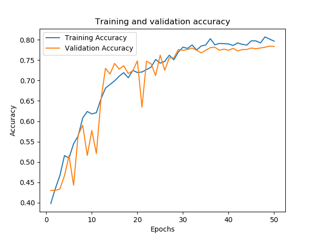
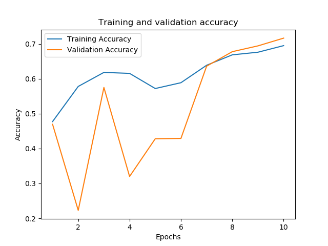
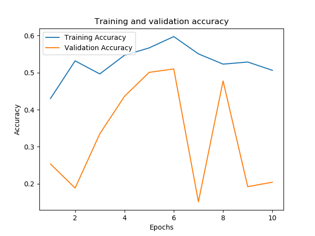
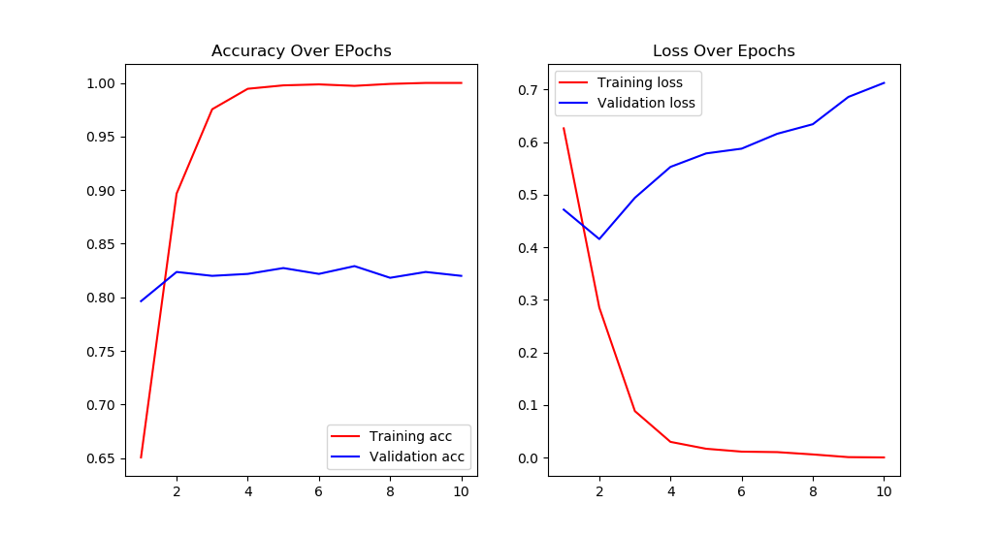
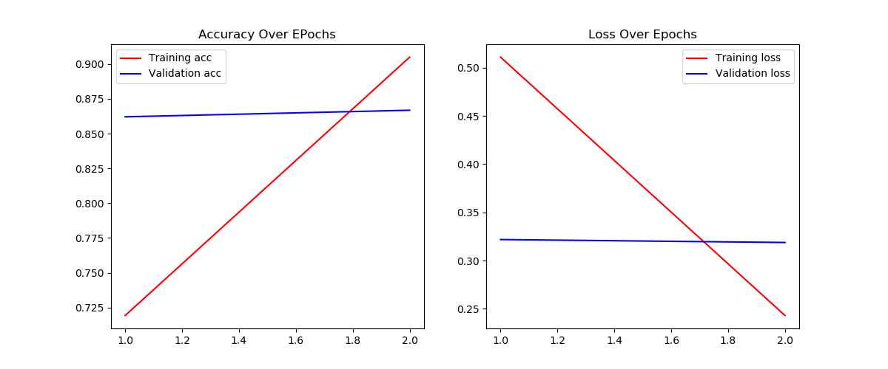
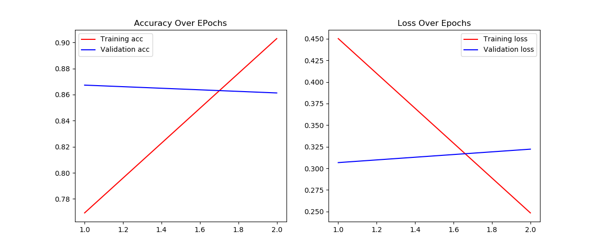
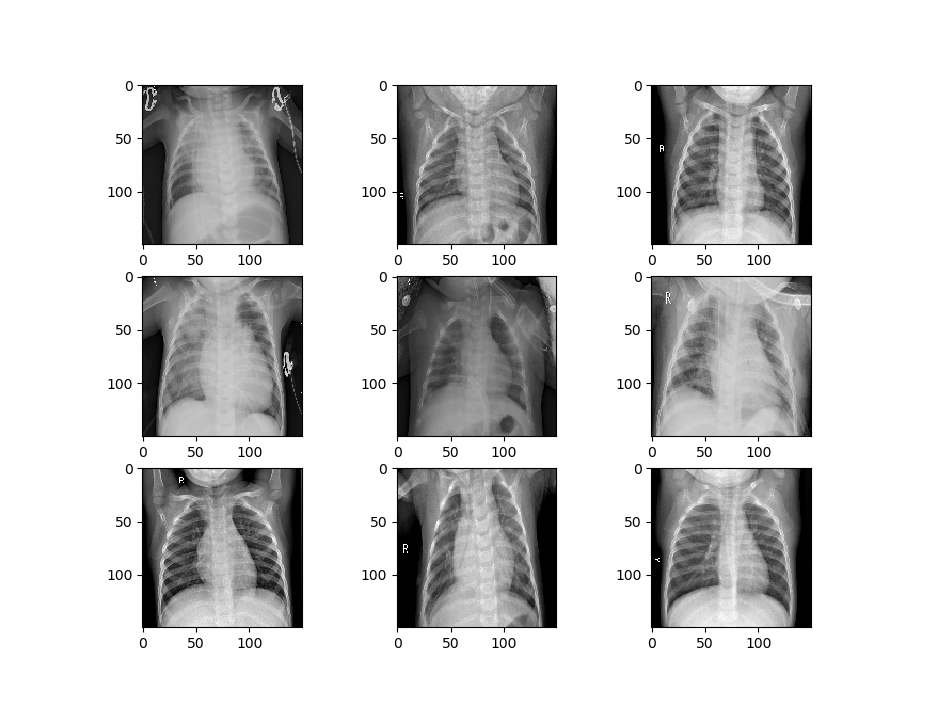
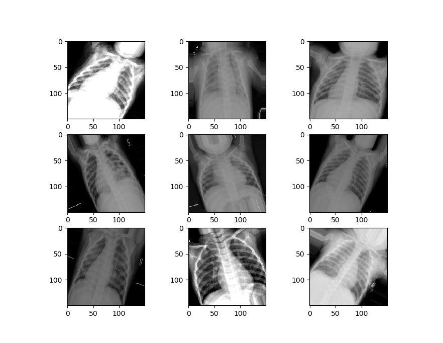
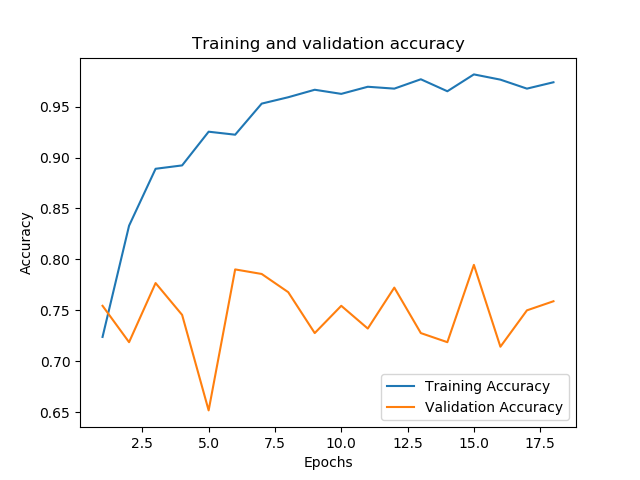
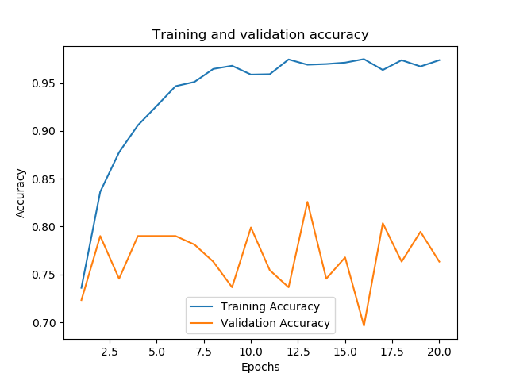

## Welcome to GitHub Pages

You can use the [editor on GitHub](https://github.com/criticallycode/criticallycode.github.io/edit/master/index.md) to maintain and preview the content for your website in Markdown files.

Whenever you commit to this repository, GitHub Pages will run [Jekyll](https://jekyllrb.com/) to rebuild the pages in your site, from the content in your Markdown files.

### Markdown

Markdown is a lightweight and easy-to-use syntax for styling your writing. It includes conventions for

```markdown

- Bulleted
- List

1. Numbered
2. List

**Bold** and _Italic_ and `Code` text

[Link](url) and 
```

# This Is My Portfolio

[Project Title 1 - Nonfunctional Link](http://reddit.com)


## Machine Learning/Deep Learning Projects

##### Blood Cell Classifier - Transfer Learning - Model Finetuning (Keras)

This project demonstrates the use of transfer learning and finetuning to classify images of blood cells. 

[Project Title 1 - Nonfunctional Link](http://reddit.com)


##### Flower Classification - Triple Model Classification (Keras)

Flowers are classified in this project, and the performance of three different models is compared. A custom model, as well as ResNet50 and InceptionV3 are compared.

[Flower Classification Repo](https://github.com/criticallycode/classifciation-of-pretty-flowers-with-keras)





##### Text Classification Comparision - (Keras)

Text classification is carried out on multiple bodies of text. An embedding model is used for the classification, and the performance of an LSTM model is compared as well.

[Text Classification Repo](https://github.com/criticallycode/cool-text-classifier-comparison)





##### X-Ray Classification Transfer Learning Tutorial - (Keras)

Classification of X-Ray medical images is carried out in this project. One classifier is trained on the original dataset and then a second set of data has perturbations applied to it to simulate image corruption. An example of transfer learning is carried out after this, retraining the original model on the new dataset.

[X-Ray Classifier Repo](https://github.com/criticallycode/cool-text-classifier-comparison)






##### CIAFR-10 Classification - Transfer Learning - (PyTorch)

Classification done on the CIFAR-10 dataset. The notebook attached to the repo also serves as a tutorial for image classification with PyTorch.

[CIFAR-10 Classification Repo](https://github.com/criticallycode/cool-CIFAR10-PyTorch)


##### Fruit Classification - (PyTorch)

Classification carried out on a dataset of over 100 fruits. The model is a custom model inheriting from nn.Module. 

[Fruits-360 Classification Repo](https://github.com/criticallycode/tasty-fruits360-with-pytorch)


##### Text Generation - Character Level - (PyTorch)

An implementation of a text generation method with Pytorch, created with a recurrent neural network.

[Text Generation with Pytorch RNN Repo](https://github.com/criticallycode/text-generation-with-PyTorch)


##### Neural Style Transfer - (PyTorch)

An example of neural style transfer done with PyTorch. The content of one image is redrawn with the style of another image by averaging the loss of the two images.

[Project Title 1 - Nonfunctional Link](http://reddit.com)


##### Mushroom Classifier

Classification and visualization of a dataset consisting of mushrooms with many different features.

[Mushroom Classifier Repo](https://github.com/criticallycode/Mushroom-Classifier-Comparison)


##### Video Game Sales
An analysis of video game sales and a comparison of several different sales prediction methods.

[Video Game Sales Analysis and Prediction Repo](https://github.com/criticallycode/Video-Game-Sales-Analysis)


##### Sentiment Analysis
A custom sentiment analysis module was created, based on the voting of multiple classifiers like Naive Bayes, Logistic Regression, Decision Trees, and Stocastic Gradient Descent. The performance of this custom sentiment analysis module is compared with the performance of other sentiment analysis modules.

[Sentiment Analysis Repo](https://github.com/criticallycode/sentiment_analysis_compare)


##### Titanic Analysis
An analysis and classfication done on the Titanic dataset. Data is preprocessed and missing values imputed, the data is then visualized and analyzed. Afterwards, multiple classifiers are run on the dataset and their performance is compared.

[Titanic Analysis Repo](https://github.com/criticallycode/awesome-titanic-analysis-prediction)


## Data Analysis

##### Facebook Text Data Analysis
This project catalogues many functions I used to visualize and analyze my own Facebook data. The analysis was carried out on text data and a number of different analytical techniques - such as sentiment analysis, named entity recognition, and word clouds - were used.

[Facebook Text Analysis Repo](https://github.com/criticallycode/Facebook_Text_Analysis)


##### GameInformer Data Analysis
Data was scraped from over 1100 reviews of games done by GameInformer. The data was then analyzed to explore patterns regarding review scores, publishers, developers, consoles and more.

[GameInformer Review Analysis Repo](https://github.com/criticallycode/gameinformer_reviews_analysis)


## Other Python Projects

##### Movie Plot Generator
This project collected plot summaries from a variety of movies catalogued at the Open Movie Database. These plot summaries were then used to create new plot ideas for writers. The project compared multiple methods of generating text, including using an LSTM neural network, a Recurrent Neural Network and Markov Chains.

[Project Title 1 - Nonfunctional Link](http://reddit.com)


##### Movie Recommendation System
A movie recommendation system based on the similarity of movie attributes such as Director, cast, genre, and various keywords. The similarities between the movies are calculated with different metrics and averaged together.

[Story Plot Generator Repo](https://github.com/criticallycode/story_plot_generator)


## Front End/Web Development

##### Javascript Ball Bounce Animation

An animation featuring multiple colored balls bouncing around, which gradually speed up.

[JavaScript Animation Here](https://criticallycode.github.io/js-animation/)

##### Javascript Custom Media Database

A custom media database that allows the user to enter and track the media they engage with. They can enter the type of media, the completion status, and any notes they have.

[Media Database Repo](https://github.com/criticallycode/javascript-custom-media-database)


##### Javascript Quiz App

A simple quiz app.

[Quiz App Here](https://criticallycode.github.io/quiz-app/)

##### Javascript Weather App

A weather app that gets weather based on your current GPS location.

[Weather App HERE](https://criticallycode.github.io/weather-app/)

##### Django Blog App

A blog app created in Django. This app allows the creation and editing of blog posts by users that can create and edit their accounts.

[Blog App Repo](https://github.com/criticallycode/django_blog_app)


##### Django Craigslist Wrapper

A wrapper for Craigslist that lets people make searches and view search results with an improved visual format.

[Craigslist Wrapper Repo](https://github.com/criticallycode/cooler-craiglist-clone)


##### Django Poll App

An app that allows users to see and vote on various polls.

[Polling App Repo](https://github.com/criticallycode/polling_app)


##### Django To-Do App

A to-do app created in Django that lets the user create items on a to-do list and delete those items when finished.

[Django To-Do Repo](https://github.com/criticallycode/smooth-todo-app)


## Tutorials

##### Keras Image Recognition Tutorial

[Project Title 1 - Nonfunctional Link](http://reddit.com)


##### Multiple Linear Regression Tutorial

[Project Title 1 - Nonfunctional Link](http://reddit.com)


##### PyTorch Transfer Learning Tutorial

[Project Title 1 - Nonfunctional Link](http://reddit.com)


##### Data Analysis and Storage with MongoDB Tutorial

[Project Title 1 - Nonfunctional Link](http://reddit.com)


